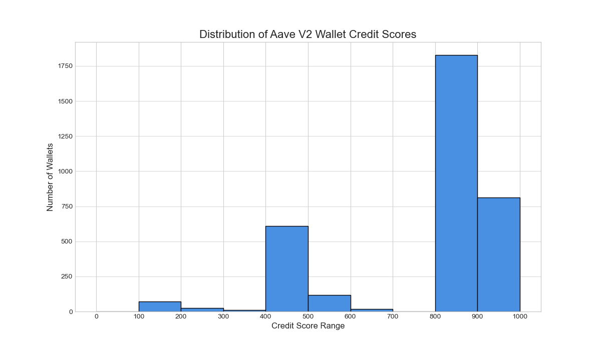

# Analysis of Wallet Credit Scores

This document provides an analysis of the credit scores generated by the model. The scores, ranging from 0 to 1000, reflect the on-chain financial behavior of wallets interacting with the Aave V2 protocol.

## Score Distribution

To understand the overall risk profile of the user base, we first visualize the distribution of the generated credit scores. The following histogram groups wallets into 100-point score bands.

